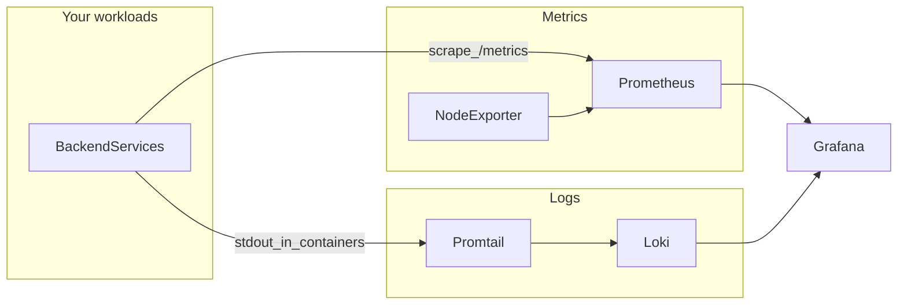

# monitoring-stack

[](https://opensource.org/licenses/MIT)
[](https://docs.docker.com/compose/)

**Clone, set credentials, run one command** — get Prometheus metrics, Loki logs, and Grafana dashboards on your own backend server (or dev machine).


| Goal | What this repo gives you |
|------|---------------------------|
| Host and stack visibility | Node Exporter + Prometheus + pre-provisioned Grafana dashboard |
| Container logs in Grafana | Promtail → Loki → Grafana Explore |
| Your app’s metrics | Add a scrape job in `prometheus/prometheus.yml` |
| Your app’s logs | Stdout in Docker, or push to Loki from the host |

---

## What you get

- **Prometheus** — scrape metrics (defaults in [prometheus/prometheus.yml](prometheus/prometheus.yml))
- **Grafana** — dashboards; datasources for Prometheus and Loki are **auto-provisioned**
- **Loki** — log store
- **Promtail** — ships Docker container logs to Loki
- **Node Exporter** — host CPU, memory, disk, and related metrics
- **Persistence** — Docker volumes for Prometheus, Grafana, and Loki data

### Architecture



---

## Requirements

- **Recommended:** Linux **x86_64** or **arm64** server with [Docker Engine](https://docs.docker.com/engine/install/) and the [Compose plugin](https://docs.docker.com/compose/install/linux/). This matches real backend deployments and the volume paths used by Node Exporter and Promtail.
- **Docker Desktop (Windows/macOS):** fine for trying the stack. **Node Exporter** reports the **Linux VM** used by Docker, not your physical Windows or Mac hardware. **Promtail** usually still collects **container** logs. Use `host.docker.internal` from Prometheus to reach apps on the host where applicable.

---

## Quick start

1. Clone the repository.

2. (Optional but recommended) Copy environment defaults and edit secrets:

   ```bash
   cp .env.example .env
   ```

   Set `GF_SECURITY_ADMIN_PASSWORD` (and optionally ports) in `.env`. Docker Compose reads `.env` automatically for variable substitution.

3. Start everything:

   ```bash
   docker compose up -d
   ```

4. Open the UIs (defaults shown; override with variables in `.env`):

   | Service | URL (defaults) |
   |---------|----------------|
   | Grafana | http://localhost:3000 |
   | Prometheus | http://localhost:9090 |
   | Loki | http://localhost:3100 |
   | Node Exporter metrics | http://localhost:9100/metrics |
   | Promtail metrics | http://localhost:9080/metrics |

   Grafana login: values of `GF_SECURITY_ADMIN_USER` / `GF_SECURITY_ADMIN_PASSWORD` (default `admin` / `admin`).

5. **Sanity checks** (defaults ports; replace if you changed `.env`):

   ```bash
   curl -sf http://localhost:9090/-/ready
   curl -sf http://localhost:3100/ready
   curl -sf http://localhost:3000/api/health
   ```

To stop:

```bash
docker compose down
```

Data is kept in Docker volumes (`prometheus_data`, `grafana_data`, `loki_data`).

### Configuration

See [.env.example](.env.example) for:

- `GF_SECURITY_ADMIN_USER`, `GF_SECURITY_ADMIN_PASSWORD`
- `PROMETHEUS_PORT`, `GRAFANA_PORT`, `LOKI_PORT`, `NODE_EXPORTER_PORT`, `PROMTAIL_METRICS_PORT`

If you change published ports, use those values in URLs and in app integrations (for example Loki push URLs).

---

## Repository layout

```
docker-compose.yml
.env.example
grafana/
  dashboards/
    node-exporter-full.json
  provisioning/
    dashboards/dashboard.yml
    datasources/datasource.yml
prometheus/
  prometheus.yml
promtail/
  promtail-config.yml
docs/
  github-repo-metadata.md   # copy-paste for GitHub About / topics
  images/
    architecture-preview.svg
```

Grafana is provisioned with:

- Prometheus at `http://prometheus:9090`
- Loki at `http://loki:3100`
- JSON dashboards in `grafana/dashboards/`

---

## Verifying on a Linux server

After `docker compose up -d` on Linux:

1. **Grafana** — http://localhost:3000 (or your `GRAFANA_PORT`) → **Connections → Data sources** → health check green for Prometheus and Loki.
2. **Dashboards** — open the provisioned Node Exporter dashboard; CPU/memory panels should populate within a scrape interval or two.
3. **Loki** — **Explore** → Loki → `{job="containerlogs"}` (or your labels) to see Docker container logs.
4. **Promtail** — needs read access to Docker’s API and container log files. On Linux, the Docker socket is mounted from the host; the user inside the Promtail image must be able to use it (typical Docker installs work). If Promtail logs show permission errors, ensure your Docker daemon socket permissions match your environment (often `docker` group membership on the **host** for the user running Compose).

The [GitHub Actions workflow](.github/workflows/compose-validate.yml) runs on **ubuntu-latest**: it validates `docker compose config`, brings the stack up, waits for Prometheus, Loki, and Grafana HTTP endpoints, then tears everything down (including volumes) so forks get a basic Linux regression check on every push and pull request.

---

## Integrating your backend (Python, Node.js, Go)

There are two parts to integrate:

1. Expose metrics for Prometheus to scrape  
2. Ship logs to Loki (via Promtail or directly)

On Windows or macOS with Docker Desktop, use `host.docker.internal` for Prometheus to reach apps running on your host. If your app runs as a container on the same Compose network, use the **service name** and port instead.

### 1) Expose metrics for Prometheus

Update [prometheus/prometheus.yml](prometheus/prometheus.yml) to add a job for your app. Example for an app on the host listening on port 8000:

```yaml
# prometheus/prometheus.yml
- job_name: 'my-backend'
  static_configs:
    - targets: ['host.docker.internal:8000']
```

If your app runs as a service in the same Compose network, use `service-name:PORT`.

#### Python (FastAPI/Flask/any WSGI)

Install:

```bash
pip install prometheus-client
```

Expose `/metrics` (example using a standalone HTTP server on port 8000):

```python
from prometheus_client import start_http_server, Counter
import time

requests_total = Counter("requests_total", "Total HTTP requests")

if __name__ == "__main__":
    start_http_server(8000)  # Exposes /metrics on :8000
    while True:
        requests_total.inc()
        time.sleep(5)
```

For FastAPI or Flask, you can use `prometheus_client` middleware or frameworks like `prometheus-fastapi-instrumentator`.

#### Node.js (Express)

Install:

```bash
npm i prom-client express
```

Expose `/metrics`:

```javascript
const express = require('express');
const client = require('prom-client');

const app = express();
client.collectDefaultMetrics();

app.get('/metrics', async (req, res) => {
  res.set('Content-Type', client.register.contentType);
  res.end(await client.register.metrics());
});

app.listen(8000, () => console.log('metrics on :8000/metrics'));
```

#### Go (net/http)

Install:

```bash
go get github.com/prometheus/client_golang/prometheus/promhttp
```

Expose `/metrics`:

```go
package main

import (
    "log"
    "net/http"
    "github.com/prometheus/client_golang/prometheus/promhttp"
)

func main() {
    http.Handle("/metrics", promhttp.Handler())
    log.Println("metrics on :8000/metrics")
    log.Fatal(http.ListenAndServe(":8000", nil))
}
```

After your app exposes metrics, add the job in `prometheus/prometheus.yml`, then restart Prometheus:

```bash
docker compose restart prometheus
```

In Grafana, import or create dashboards and select the **Prometheus** data source.

---

### 2) Ship logs to Loki

This stack ships Docker container logs via Promtail using:

```yaml
# promtail/promtail-config.yml
clients:
  - url: http://loki:3100/loki/api/v1/push
scrape_configs:
  - job_name: containers
    static_configs:
      - targets: [localhost]
        labels:
          job: containerlogs
          __path__: /var/lib/docker/containers/*/*log
    pipeline_stages:
      - docker: {}
      - labelmap:
          regex: __meta_docker_container_label_(.+)
      - match:
          selector: '{grafana_job=""}'
          action: drop
```

If your backend runs as a container on the same Docker Engine, logging to **stdout/stderr** is enough. Promtail forwards those logs to Loki; query them in Grafana with the **Loki** data source.

If your backend runs on the host (outside Docker), you can:

- Run Promtail (or another agent) to tail log files and push to `http://localhost:${LOKI_PORT:-3100}`, or  
- Use a Loki client library and push to `http://localhost:${LOKI_PORT:-3100}/loki/api/v1/push`

#### Python logging to Loki (direct)

```bash
pip install python-logging-loki
```

```python
import logging
from logging_loki import LokiHandler

handler = LokiHandler(
    url="http://localhost:3100/loki/api/v1/push",
    tags={"app": "my-python-app"},
)

logger = logging.getLogger("my-python-app")
logger.setLevel(logging.INFO)
logger.addHandler(handler)
logger.info("hello from python")
```

#### Node.js logging to Loki (direct)

```bash
npm i winston winston-loki
```

```javascript
const winston = require('winston');
const LokiTransport = require('winston-loki');

const logger = winston.createLogger({
  transports: [
    new LokiTransport({ host: 'http://localhost:3100', labels: { app: 'my-node-app' } })
  ]
});

logger.info('hello from node');
```

#### Go logging to Loki (direct)

```bash
go get github.com/grafana/loki-client-go/loki
```

```go
package main

import (
    "context"
    "log"
    "time"
    "github.com/grafana/loki-client-go/loki"
)

func main() {
    cfg := loki.Config{URL: "http://localhost:3100/loki/api/v1/push"}
    client, err := loki.New(cfg)
    if err != nil { log.Fatal(err) }
    defer client.Close()

    labels := map[string]string{"app": "my-go-app"}
    err = client.Handle(context.Background(), time.Now(), labels, "hello from go")
    if err != nil { log.Fatal(err) }
}
```

---

## Production checklist

- [ ] Set strong `GF_SECURITY_ADMIN_PASSWORD` in `.env` (never commit `.env`).
- [ ] Do not expose Grafana, Prometheus, or Loki to the public internet without **TLS** and **authentication** at the edge (reverse proxy, VPN, or cloud load balancer rules).
- [ ] Restrict firewall rules to admin IPs or internal networks.
- [ ] Plan **retention**: Prometheus and Loki defaults are suitable for demos; tune TSDB and Loki retention for your disk budget (see upstream docs for `prometheus` and `loki` flags when you outgrow defaults).

---

## Common tasks

Restart a single service:

```bash
docker compose restart grafana
```

View logs for a service:

```bash
docker compose logs -f promtail
```

Add another dashboard: drop a JSON file into `grafana/dashboards/` and refresh Grafana.

---

## Troubleshooting

- **No metrics from your app**  
  - Confirm `/metrics` responds on the host or container.  
  - Ensure `prometheus/prometheus.yml` targets `host.docker.internal:PORT` (Desktop) or the correct service name.  
  - `docker compose restart prometheus` after edits.

- **No logs from your app**  
  - Containerized apps should log to stdout/stderr.  
  - On the host, use Promtail tailing files or a Loki client (see above).  
  - Check `docker compose logs -f promtail`.

- **Grafana empty panels**  
  - Pick the correct datasource (Prometheus vs Loki).  
  - **Connections → Data sources** → **Save & test**.

- **Promtail permission errors on Linux**  
  - Ensure Docker socket and container log paths are accessible to the Promtail container; see [Verifying on a Linux server](#verifying-on-a-linux-server).

---

## Security

- Default Grafana credentials are for **local demos only**. Change them via `.env` before any non-local use. See [SECURITY.md](SECURITY.md) for reporting issues.

---

## Contributing and license

See [CONTRIBUTING.md](CONTRIBUTING.md). Licensed under the [MIT License](LICENSE).

---

## GitHub profile pin

Copy suggested **description** and **topics** from [docs/github-repo-metadata.md](docs/github-repo-metadata.md) into your repository **About** settings, then pin the repo on your profile.
